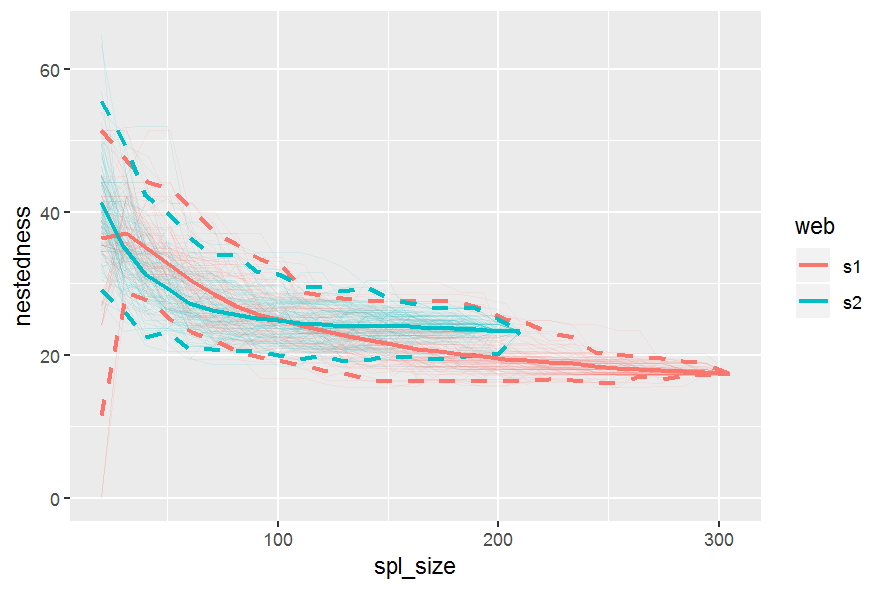

# bootstrapnet

## Overview

R package for resampling network metrics/indices (bootstrapping without replacement).

GitHub site at: https://valentinitnelav.github.io/bootstrapnet/index.html

It wraps around the [bipartite][bip] package functions `networklevel` and `specieslevel`. 

Assuming a network/web like `Safariland` from the bipartite package:

``` r
library(bipartite)
data(Safariland)
```
One can sample interactions without replacement from the network until all interactions have been used. The sampling procedure starts with a small sample size to which interactions are added until all are consumed. Every time we sample interactions, a smaller version of the entire network can be built and a network index/metric can be computed. The sampling procedure can be repeated as many times as needed, giving the possibility to compute mean values with quantile-based confidence intervals. The mean values across sample sizes can be plotted and indices of different networks can be visually compared. See examples below.

[bip]: https://cran.r-project.org/web/packages/bipartite/index.html


## Installation

You can install `bootstrapnet` from GitHub with:

``` r
# install.packages("devtools")
devtools::install_github("valentinitnelav/bootstrapnet")
```

## Examples

See more examples [here](https://valentinitnelav.github.io/bootstrapnet/examples.html)

### Resample two networks with computing "nestedness".

``` r
library(bootstrapnet)
library(bipartite)
library(magrittr)
data(Safariland)

# Generate two fictive networks to compare

set.seed(321)
Safariland_1 <- Safariland[, sort(sample.int(ncol(Safariland), 20))]
set.seed(123)
Safariland_2 <- Safariland[, sort(sample.int(ncol(Safariland), 20))]


# Resample the two networks with computing "nestedness". The computation is
# carried in parallel.

lst_nest <- list(s1 = Safariland_1, s2 = Safariland_2) %>%
  lapply(web_matrix_to_df) %>%
  boot_networklevel(col_lower = "lower", # column name for plants
                    col_higher = "higher", # column name for insects
                    index = "nestedness",
                    level = "both", # here, nestedness is not affected by level
                    start = 20,
                    step = 10,
                    n_boot = 100,
                    n_cpu = 3)
# approx. 1 min of CPU time

gg_networklevel(lst_nest)
```

<!--
saveRDS(lst_nest, file = "man/figures/README-example-nestedness-1-lst.rds")
lst_nest <- readRDS(file = "man/figures/README-example-nestedness-1-lst.rds")

library(ggplot2)

ggsave(filename = "man/figures/README-example-nestedness-1.png",
       width = 15, height = 10, units = "cm", dpi = 150)
-->


