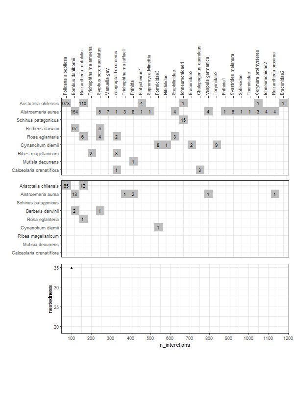

# bootstrapnet

## Overview

R package for resampling network metrics/indices (bootstrapping without replacement).

GitHub site at: https://valentinitnelav.github.io/bootstrapnet/index.html

It wraps around the [bipartite][bip] package functions `networklevel` and `specieslevel`. 

Assuming a network/web like `Safariland` from the bipartite package:

``` r
library(bipartite)
data(Safariland)
```
One can sample interactions without replacement from the network until all interactions have been used. The sampling procedure starts with a small sample size to which interactions are added until all are consumed. Every time we sample interactions, a smaller version of the entire network can be built and a network index/metric can be computed. The sampling procedure can be repeated as many times as needed, giving the possibility to compute mean values with quantile-based confidence intervals. The mean values across sample sizes can be plotted and indices of different networks can be visually compared. See examples below.

[bip]: https://cran.r-project.org/web/packages/bipartite/index.html

Below is an animation of the sampling method (one iteration). A detailed explanation of the method can be found [here](https://valentinitnelav.github.io/bootstrapnet/explain-sampling-method.html).



## Installation

You can install `bootstrapnet` from GitHub with:

``` r
# install.packages("devtools")
devtools::install_github("valentinitnelav/bootstrapnet")
```

## Examples

See more examples [here](https://valentinitnelav.github.io/bootstrapnet/examples.html)

### Resample two networks with computing "nestedness".

``` r
library(bootstrapnet)
library(bipartite)
library(magrittr)
data(Safariland)

# Generate two fictive networks to compare

set.seed(321)
Safariland_1 <- Safariland[, sort(sample.int(ncol(Safariland), 20))]
set.seed(123)
Safariland_2 <- Safariland[, sort(sample.int(ncol(Safariland), 20))]


# Resample the two networks with computing "nestedness". The computation is
# carried in parallel.

lst_nest <- list(s1 = Safariland_1, s2 = Safariland_2) %>%
  lapply(web_matrix_to_df) %>%
  boot_networklevel(col_lower = "lower", # column name for plants
                    col_higher = "higher", # column name for insects
                    index = "nestedness",
                    level = "both", # here, nestedness is not affected by level
                    start = 20,
                    step = 10,
                    n_boot = 100,
                    n_cpu = 3)
# approx. 1 min of CPU time

gg_networklevel(lst_nest)
```

<!--
saveRDS(lst_nest, file = "man/cache/README-example-nestedness-1-lst.rds")
lst_nest <- readRDS(file = "man/cache/README-example-nestedness-1-lst.rds")

library(ggplot2)

ggsave(filename = "man/cache/README-example-nestedness-1.png",
       width = 15, height = 10, units = "cm", dpi = 150)
-->


`spl_size` represents the number of interactions sampled (without replacement) from each network/web (here, s1 and s2). The first sample is set to `start = 20` interactions. These 20 interactions form a small web for which a nestedness value is computed. Then we add 10 more randomly sampled interactions (`step = 10`) that where not sampled yet. The new network has now 30 interactions and a new nestedness is computed for `spl_size = 30`, and so on until all interactions were sampled (that is, the entire web).

So, after the first `start = 20` sample, at each step of 10 sampled interactions (`step = 10`), a metric is computed (here nestedness). The last computed index value (right most tip of a bootstrap mean line) corresponds to the index value of the entire network (because at this point, as mentioned above, the entire network was sampled). 

These operations are repeated `n_boot = 100` times in parallel on `n_cpu = 3` CPUs for each web (s1 & s2). For each web, each thinner line represents one of the 100 iterations. Having 100 nestedness values at each `spl_size`, then we can compute an average and the 95% quantile-based confidence intervals (CI) around it. Therefore, we get the mean thicker line and its 95% CI dashed lines. Is normal to see wider 95% CIs at smaller `spl_size` since there is high variation in the networks constructed from the few sampled interactions. At the otehr end, the CIs have to converge at the final index value, which is the index of the entire network (see values below).

The same resampling / bootstrapping procedure is applied for species level indices.

``` r
# The last computed index value (right most tip of a bootstrap mean line)
# corresponds to the index value of the entire network:

networklevel(Safariland_1, index = "nestedness")
## nestedness
##  17.36351

networklevel(Safariland_2, index = "nestedness")
## nestedness
##  23.23792
```

#### Discussion

Such accumulation/rarefaction curves allow comparison of networks/webs with different number of interactions. Ideally the indices/metrics will be compared if the curves display a trend of reaching an asymptote. That means that if we keep on investing effort to sample interactions (observe plant-pollinator in the field) we will not gain much further information, so network comparison is already possible.

Here, the web s2, even though has fewer interactions, seems to produce a stable, asymptotic resampled nestedness (blue line) as the one of web s1 (red line). The two networks are not much different in terms of nestedness, since the 95% CI overlap considerably.


## Acknowledgments

Many thanks to [Tiffany Knight](https://www.ufz.de/index.php?en=38645), my beloved professor without whom the development of this package would not have been possible.
